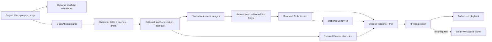
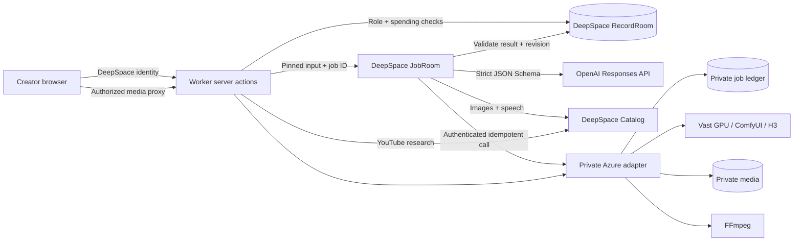

# Illustory

**An AI filmmaking studio that takes a creative team from script to finished video.**

Creators often move between a chatbot, image and video tools, shared documents, and editing software. Those handoffs make it hard to keep characters consistent, know which shot was approved, or recover a failed render. Illustory gives the team one editable production plan and a versioned history of its assets. Editors shape the story, owners submit paid generation, and reviewers select the final cut.

This is a DeepSpace adaptation of my existing Illustory product, shaped by conversations about AI video work with content creators and e-commerce advertising teams. The live pilot produced four H3 shots and a **32.8-second, 1920×1080 MP4** that played in the deployed Studio. That proves the script-to-export path; it is not a measured claim about customer adoption or team productivity. [Open the Studio](https://illustory.app.space/studio) · [Verification record](docs/VERIFICATION.md)

## Find your way around

| Location | What to inspect |
|---|---|
| [Studio UI](src/pages/%28app%29/%28protected%29/studio.tsx) and [styles](src/pages/%28app%29/%28protected%29/studio.css) | Script, Cast, Scenes, Shots, and Edit & Export; version selection and Activity. |
| [Film domain](src/illustory/) | Product types, creative rules, structured output, provider adapters, and validation. Start with [types](src/illustory/types.ts), [model output schema](src/illustory/structured-output.ts), and [parse mapping](src/illustory/original-creative.ts). |
| [Persistent schemas](src/schemas/) | DeepSpace user, workspace, membership, project, job, and asset records. |
| [Server actions](src/actions/index.ts) | Membership, roles, project revisions, job requests, and asset selection. |
| [Job runner](src/jobs.ts) | Durable execution, provider calls, checkpoints, validation, and publication. |
| [HTTP routes](src/server/) and [Worker entry](worker.ts) | Authorized media access and DeepSpace runtime wiring. |
| [Catalog client](src/illustory/catalog.ts) and [private engine client](src/illustory/private-workflow.ts) | External integration contracts. |
| [Browser tests](tests/) and colocated unit tests | Role, workflow, and rendering checks. |
| [Build helpers](tooling/) and [static assets](public/) | Public-page prerendering and browser assets. |
| [Documentation](docs/) | [Architecture](docs/IMPLEMENTATION.md), [setup](docs/RUNNING.md), [verification](docs/VERIFICATION.md), [GPU contract](docs/GPU_EXECUTION.md), and [spending policy](docs/SPENDING_ACCESS.md). |

Root files are the entry points and configuration that the build and deployment tools expect there. npm and `package-lock.json` are the package-management source of truth.

## From script to export



The schema is the handoff contract. Parsing creates a Character Bible, then scenes and shots with locations, cast, a static first-frame description, timed motion beats, dialogue, camera framing, and emotions. People can edit these fields before choosing what to generate. Each asset stores its source revision and version, so a new render does not silently replace an approved one.

**Observed live:** parsing, reference images, first frames, four H3 clips, version selection, export, playback, and three YouTube planning links. Voice selection and speech are implemented and unit tested, but have no recorded live acceptance run. SeedVR2 is wired but not installed on the current GPU. Email delivery awaits a sender configuration; export succeeds independently. [Evidence and open items](docs/VERIFICATION.md).

## How the app runs



1. A signed-in user chooses a workspace. Every server action checks active membership and the role required for that operation. Paid actions also require separate approval from the app owner.
2. An edit saves a project revision. A generation request fixes its inputs, checks prerequisites, records an idempotency key, and returns a queryable DeepSpace job ID.
3. JobRoom calls the appropriate provider or the private adapter and records progress. The adapter gives longer GPU work a stable private ID, so checking an ambiguous result does not automatically submit another render.
4. Before publishing an asset version, the Worker checks result metadata, cancellation, and the pinned revision. The browser reads job status and media through authorized routes. [Concurrent-edit limitation](docs/IMPLEMENTATION.md#engineering-gaps).

Owner, editor, reviewer, and viewer permissions are enforced on the server. Editors develop the storyboard; reviewers select versions and request export; owners manage membership and generation; viewers inspect the workspace. A workspace role alone never grants use of the app owner's provider credits. See the [exact role table](docs/IMPLEMENTATION.md#roles).

## Integration decisions

| Capability | Value in this workflow | Boundary |
|---|---|---|
| **DeepSpace Auth + RecordRoom** | Login, workspaces, project state, roles, jobs, and asset versions persist across refreshes. | SDK primitives, not Catalog integrations. |
| **DeepSpace JobRoom** | Long-running work has a durable ID, status, pinned input, and recovery path. | The browser does not hold a render request open. |
| **DeepSpace OpenAI image integration** | Generates character and scene references with `gpt-image-2`. | Catalog's image contract fits this step. |
| **DeepSpace ElevenLabs integration** | Lists voice IDs and creates a short speech reference for a selected voice. | Optional; this build does not clone voices. |
| **DeepSpace YouTube integration** | Returns up to three links from a project's title and synopsis. | Optional research beside the production plan. |
| **DeepSpace Email integration** | Can notify the workspace owner when an export is ready. | Implemented; delivery awaits sender configuration. |
| **Direct OpenAI Responses API** | Parses my Character Bible and storyboard with provider-enforced strict JSON Schema. | The Catalog chat contract available to this build did not expose the schema control this parser needs. The key stays in a server secret. |
| **Private Azure + Vast engine** | Builds reference-conditioned first frames, runs my Minimax H3/ComfyUI workflow, stores private media, and exports through FFmpeg. | DeepSpace handles identity, orchestration, and asset publication; the existing GPU workflow runs on a separately operated service. Its implementation and credentials stay outside this repo. |

I developed and tuned the private H3 workflow before this adaptation. In earlier runs I observed approximately **90% shorter generation time** while reviewing output quality, but this repository has no controlled comparison. I would repeat matched shots on the same hardware and report model/workflow versions, GPU time, cost, and human quality scores before treating that percentage as a benchmark. [Current verification limits](docs/VERIFICATION.md).

Catalog image generation fits character and scene references. A shot's first frame has a different requirement: it must follow the selected visual references and the shot's composition, so I kept that stage in my reference-conditioned private engine alongside H3. The public repository still shows the authenticated call, pinned inputs, result checks, and asset publication.

I left out payment checkout because this is a controlled evaluation pilot. Job status uses authorized polling rather than broad real-time subscriptions, so the current UI does not offer simultaneous text editing. Project writes need an atomic revision guard before several editors can safely save the same project concurrently. Automatic provider dollar caps also remain open; approval and a manual pause switch are the current spending controls. Adding services solely to increase the integration count would not help this workflow.

## Product and GTM judgment

The discovery was a workflow problem: AI tools could generate individual assets, but teams still had to coordinate scripts, cast, shots, approvals, and versions across several interfaces. My hypothesis was that a structured, editable production plan would make those handoffs easier to see and repeat. I built the original Illustory workflow and adapted a focused slice to DeepSpace so a developer can inspect the schema, service boundaries, and working output.

The first live experiment established that a script can reach a playable export. The next experiment is with an invited creative team: measure time from brief to approved cut, regenerations per shot, cost per accepted clip, and where collaborators leave the flow. Those numbers would support an efficiency or adoption claim; one completed pilot project cannot. That is how I would present and distribute a developer tool as well: show the useful path, identify what was measured, and learn from real users.

## Run and review

```sh
npm ci
npm run validate
npm run lint
npm run format:check
npm run build
npm run dev
```

Local use needs a DeepSpace login. Paid generation also needs server-side secrets, spending approval, and the private engine. A clone cannot render video on its own. [Setup and deployment](docs/RUNNING.md).

The deployed app is [illustory.app.space/studio](https://illustory.app.space/studio). Signing in does not expose the owner's projects or credits. A reviewer can provide their DeepSpace user ID from Settings so the owner can grant review-workspace access and, separately, approve any paid test. The export is served through workspace-authorized playback. I have not copied the 22 MB MP4 into this public repository or embedded a public media URL. Its playback is documented in the [verification notes](docs/VERIFICATION.md) and [export recovery record](docs/EXPORT_RECOVERY.md).

I supplied the existing product flow, schemas, creative rules, and private-engine boundary, and directed the coding agent's DeepSpace adaptation. The agent implemented the UI, platform records and jobs, integrations, authorization, and tests; I reviewed product behavior and initiated the live model/GPU run. We traced a failed export publication to media integrity validation, recovered the same private result without another GPU render, and verified browser playback. The code and limitations are open for review; GPU nodes, model files, customer media, and credentials remain private.
