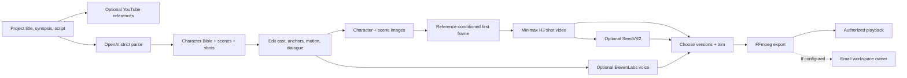
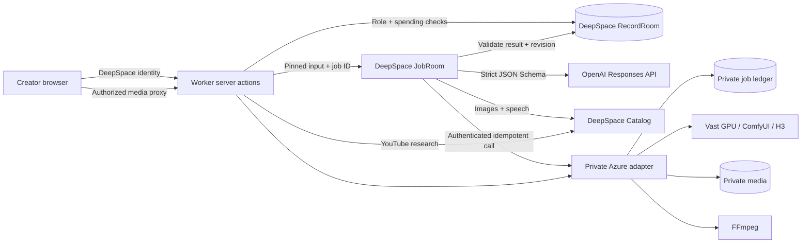

# Illustory Studio

> **Reviewer access:** The [live Studio](https://illustory.app.space/studio) and this source repository are available to review. After signing in with DeepSpace, you can create your own workspace, but the completed demo project and its media are private. To inspect that work, send me the DeepSpace user ID shown in **Settings** so I can invite you to the review workspace. Live AI and GPU generation also requires separate, server-side spending approval because it uses my paid provider accounts. The Studio includes a **Request access** action that emails me when a sender is configured; requesting never grants credits automatically. [Access details](docs/SPENDING_ACCESS.md) · [Verified run and limitations](docs/VERIFICATION.md).

**An AI filmmaking studio that takes a creative team from script to finished video.**

Creators often move between a chatbot, image and video tools, shared documents, and editing software. Those handoffs make it hard to keep characters consistent, know which shot was approved, or recover a failed render. Illustory gives the team one editable production plan and a versioned history of its assets. Editors shape the story, owners submit paid generation, and reviewers select the final cut.

This is a DeepSpace adaptation of my existing Illustory product, shaped by conversations about AI video work with content creators and e-commerce advertising teams. The live pilot produced four H3 shots and a **32.8-second, 1920×1080 MP4** that played in the deployed Studio. [Open the Studio](https://illustory.app.space/studio) · [Verification record](docs/VERIFICATION.md)

## Repository map

| Folder or root file | Purpose |
|---|---|
| [`src/`](src/) | All application source: browser UI, server actions, schemas, provider clients, and job orchestration. The table below is the code-reading guide. |
| [`tests/`](tests/) | Browser smoke and role suites, plus the unit-test runner configuration. Unit tests also sit beside their source. |
| [`tooling/`](tooling/) | Build-time prerendering of the public page. |
| [`public/`](public/) | Static favicon, robots file, and response headers. |
| [`docs/`](docs/) | [Architecture](docs/IMPLEMENTATION.md), [setup](docs/RUNNING.md), [verification](docs/VERIFICATION.md), [GPU boundary](docs/GPU_EXECUTION.md), and [spending controls](docs/SPENDING_ACCESS.md). |
| [`worker.ts`](worker.ts), [`vite.config.ts`](vite.config.ts), [`wrangler.toml`](wrangler.toml) | DeepSpace Worker entry, app build, and deployment bindings. |
| [`package.json`](package.json), [`package-lock.json`](package-lock.json) | npm scripts and locked dependencies. |

### Inside `src/`

| Path | Key files and responsibility |
|---|---|
| [`pages/`](src/pages/) | [`studio.tsx`](src/pages/%28app%29/%28protected%29/studio.tsx) and [`studio.css`](src/pages/%28app%29/%28protected%29/studio.css) implement the five production stages, version chooser, and Activity. [`settings.tsx`](src/pages/%28app%29/%28protected%29/settings.tsx) shows account identity; route layouts protect signed-in pages. |
| [`components/`](src/components/) | Navigation, SEO, errors, and reusable buttons, menus, tooltips, and status UI. |
| [`illustory/`](src/illustory/) | [`types.ts`](src/illustory/types.ts) defines the editable film plan. [`original-rules.ts`](src/illustory/original-rules.ts) and [`original-creative.ts`](src/illustory/original-creative.ts) build and validate the two-stage script parse. [`structured-output.ts`](src/illustory/structured-output.ts) supplies strict JSON Schemas. [`catalog.ts`](src/illustory/catalog.ts) handles images, voices, and YouTube results; [`private-workflow.ts`](src/illustory/private-workflow.ts) calls and verifies the private engine. |
| [`schemas/`](src/schemas/) | [`illustory-schemas.ts`](src/schemas/illustory-schemas.ts) declares workspaces, memberships, projects, jobs, and versioned assets. User and admin records have separate files. |
| [`actions/`](src/actions/) | [`index.ts`](src/actions/index.ts) checks identity, workspace role, spending approval, expected revision, and job idempotency before user actions. |
| [`jobs.ts`](src/jobs.ts) | Dispatch and continue background work, checkpoint external calls, validate outputs, publish asset versions, and optionally notify the owner. [`cron.ts`](src/cron.ts) is an unused SDK scaffold hook; no scheduled task is claimed here. |
| [`server/`](src/server/) | Route registration, action HTTP boundary, and workspace-authorized media proxy. |
| Root of `src/` | [`main.tsx`](src/main.tsx) mounts React; [`schemas.ts`](src/schemas.ts) registers collections; [`integrations.ts`](src/integrations.ts) and [`subscriptions.ts`](src/subscriptions.ts) configure DeepSpace app features. |

## From script to export



The schema is the handoff contract. Parsing creates a Character Bible, then scenes and shots with locations, cast, a static first-frame description, timed motion beats, dialogue, camera framing, and emotions. People can edit these fields before choosing what to generate. Each asset stores its source revision and version, so a new render does not silently replace an approved one.

**Observed live:** parsing, reference images, first frames, four H3 clips, version selection, export, playback, and three YouTube planning links. Voice selection and speech are implemented and unit tested, but have no recorded live acceptance run. SeedVR2 is wired but not installed on the current GPU. Email delivery awaits a sender configuration; export succeeds independently. [Evidence and open items](docs/VERIFICATION.md).

## How the app runs



1. A signed-in user chooses a workspace. Every server action checks active membership and the role required for that operation. Paid actions also require separate approval from the app owner.
2. An edit saves a project revision. A generation request fixes its inputs, checks prerequisites, records an idempotency key, and returns a queryable DeepSpace job ID.
3. JobRoom calls the appropriate provider or the private adapter and records progress. The adapter gives longer GPU work a stable private ID, so checking an ambiguous result does not automatically submit another render.
4. Before publishing an asset version, the Worker checks result metadata, cancellation, and the pinned revision. The browser reads job status and media through authorized routes. [Concurrent-edit limitation](docs/IMPLEMENTATION.md#engineering-gaps).

Owner, editor, reviewer, and viewer permissions are enforced on the server. Editors develop the storyboard; reviewers select versions and request export; owners manage membership and generation; viewers inspect the workspace. A workspace role alone never grants use of the app owner's provider credits. See the [exact role table](docs/IMPLEMENTATION.md#roles).

### The technical handoffs

| Work in a creative team | Technology and exact handoff | Result the next person can use |
|---|---|---|
| **Writing and planning** | The editor enters a script. [`original-creative.ts`](src/illustory/original-creative.ts) first requests a Character Bible, then passes it into scene/shot parsing. [`structured-output.ts`](src/illustory/structured-output.ts) sends strict JSON Schemas to OpenAI Responses with `store: false`; the returned data is validated and mapped into editable project state. | Cast descriptions, scene anchors, shots, dialogue, camera choices, and timed motion beats rather than a prose blob. |
| **Research and visual development** | A project title and synopsis feed DeepSpace YouTube search; the Studio keeps up to three links with the project. For approved generation, [`catalog.ts`](src/illustory/catalog.ts) calls DeepSpace's OpenAI `gpt-image-2` endpoint for character and scene references. | Reference options attached to the same storyboard the team edits. |
| **Voice and character continuity** | The ElevenLabs catalog supplies selectable `voice_id` values; a chosen voice and short text can produce a speech reference. Cast and scene references then become inputs to a shot's private first-frame request. | A chosen character look and voice remain connected to a named shot and asset version. |
| **Production and GPU operations** | [`actions/index.ts`](src/actions/index.ts) pins the shot and selected assets to a project revision. [`jobs.ts`](src/jobs.ts) creates a DeepSpace job, while [`private-workflow.ts`](src/illustory/private-workflow.ts) submits an authenticated request with an `Idempotency-Key` to the Azure adapter. The adapter runs reference-conditioned first frames and the H3/ComfyUI workflow on Vast. | A trackable job with a provider ID, state, error, and immutable media metadata. |
| **Review and delivery** | The Worker checks byte size and SHA-256 metadata, cancellation, and input revision before saving a new asset version. An owner or editor sets trims; a reviewer can choose asset versions and request the private FFmpeg export. Workspace-authorized routes serve playback. Email can alert the owner once configured. | An inspectable final cut with a known source revision and a clear approval boundary. |

This division lets a content or advertising team collaborate on creative decisions without sharing provider accounts or copying prompts and files between tools. It also gives a technical reviewer concrete points to inspect: schema validation, server authorization, idempotent external execution, integrity checks, and stale-result handling. The GPU workflow remains in the separately operated private service; the public code shows its API contract and the complete DeepSpace control plane.

## Integration decisions

| Capability | Value in this workflow | Boundary |
|---|---|---|
| **DeepSpace Auth + RecordRoom** | Login, workspaces, project state, roles, jobs, and asset versions persist across refreshes. | SDK primitives, not Catalog integrations. |
| **DeepSpace JobRoom** | Long-running work has a durable ID, status, pinned input, and recovery path. | The browser does not hold a render request open. |
| **DeepSpace OpenAI image integration** | Generates character and scene references with `gpt-image-2`. | Catalog's image contract fits this step. |
| **DeepSpace ElevenLabs integration** | Lists voice IDs and creates a short speech reference for a selected voice. | Optional; this build does not clone voices. |
| **DeepSpace YouTube integration** | Returns up to three links from a project's title and synopsis. | Optional research beside the production plan. |
| **DeepSpace Email integration** | Can notify the workspace owner when an export is ready. | Implemented; delivery awaits sender configuration. |
| **Direct OpenAI Responses API** | Parses my Character Bible and storyboard with provider-enforced strict JSON Schema. | The Catalog chat contract available to this build did not expose the schema control this parser needs. The key stays in a server secret. |
| **Private Azure + Vast engine** | Builds reference-conditioned first frames, runs my Minimax H3/ComfyUI workflow, stores private media, and exports through FFmpeg. | DeepSpace handles identity, orchestration, and asset publication; the existing GPU workflow runs on a separately operated service. Its implementation and credentials stay outside this repo. |

I developed and tuned the private H3 workflow before this adaptation. The [original Illustory.ai repository](https://github.com/susunbourne/Illustory.ai) contains the broader product and GPU implementation; it is private, so reviewers need access from me to inspect it. In earlier runs I observed approximately **90% faster generation** while reviewing output quality, but this submission has no controlled comparison. I would repeat matched shots on the same hardware and report model/workflow versions, GPU time, cost, and human quality scores before treating that percentage as a benchmark. [Current verification limits](docs/VERIFICATION.md).

Catalog image generation fits character and scene references. A shot's first frame has a different requirement: it must follow the selected visual references and the shot's composition, so I kept that stage in my reference-conditioned private engine alongside H3. The public repository still shows the authenticated call, pinned inputs, result checks, and asset publication.

I left out payment checkout because this is a controlled evaluation pilot. Job status uses authorized polling rather than broad real-time subscriptions, so the current UI does not offer simultaneous text editing. Project writes need an atomic revision guard before several editors can safely save the same project concurrently. Automatic provider dollar caps also remain open; approval and a manual pause switch are the current spending controls. Adding services solely to increase the integration count would not help this workflow.

## Product and GTM judgment

**Discover.** Conversations with content creators and e-commerce advertising teams exposed a recurring cost: models could make individual images and clips, but people still had to reconstruct the same brief, cast, scene, and approval history in multiple products. I chose the handoff from script to approved video as the problem to solve.

**Experiment and build.** I defined the storyboard schema and creative rules in the original Illustory product, then tested whether the same workflow could run as a smaller, reviewable DeepSpace app. The specific experiment was to take one script through parsing, editable shot planning, reference assets, four GPU clips, version selection, and a playable export. The live result is linked above. The decision to use direct structured parsing and a private GPU engine came from the contracts these steps require, while DeepSpace supplies identity, durable state, jobs, and fitting Catalog integrations.

**Distribute and learn.** I can show a creative or advertising team the working Studio, invite members into a workspace, and observe whether they reach an approved cut. The next growth experiment will track invitations → activated workspaces → completed storyboards → accepted clips → exports, alongside time from brief to approval, regenerations per shot, and cost per accepted clip. Feedback at each stage tells me whether to improve onboarding, schema guidance, visual consistency, or GPU cost before expanding distribution. That connects a technical demo to adoption work rather than treating page views as success.

## Run and review

```sh
npm ci
npm run validate
npm run lint
npm run format:check
npm run build
npm run dev
```

Local use needs a DeepSpace login. Paid generation also needs server-side secrets, spending approval, and the private engine. A clone cannot render video on its own. [Setup and deployment](docs/RUNNING.md).

The deployed app is [illustory.app.space/studio](https://illustory.app.space/studio). Signing in does not expose the owner's projects or credits. A reviewer can provide their DeepSpace user ID from Settings so the owner can grant review-workspace access and, separately, approve any paid test. The export is served through workspace-authorized playback. I have not copied the 22 MB MP4 into this public repository or embedded a public media URL. Its playback is documented in the [verification notes](docs/VERIFICATION.md) and [export recovery record](docs/EXPORT_RECOVERY.md).

I supplied the existing product flow, schemas, creative rules, and private-engine boundary, and directed the coding agent's DeepSpace adaptation. The agent implemented the UI, platform records and jobs, integrations, authorization, and tests; I reviewed product behavior and initiated the live model/GPU run.
