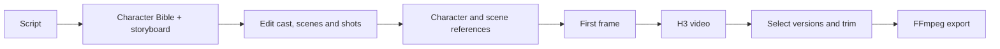

# Illustory

**A shared filmmaking workspace for small creative teams.**

[Open the studio](https://illustory.app.space/studio) · [Run locally](docs/RUNNING.md) · [Architecture](docs/IMPLEMENTATION.md) · [Verification](docs/VERIFICATION.md)

Illustory turns a script into an editable production plan: characters, scenes,
shots, dialogue and motion beats. A team can refine that plan, generate reference
images and video, select versions, and export a cut in the same workspace.
Owners approve generation, editors develop the storyboard, and reviewers select
assets. Each generated asset records the job and input revision it came from.

This is a DeepSpace adaptation of my existing Illustory product. The screenplay
rules and schema come from that product; the application uses DeepSpace for
identity, persistence, background jobs and selected external APIs.

## The workflow



YouTube search offers three references during planning. ElevenLabs supplies
selectable voices and short voice references. Export can notify the workspace
owner by email when a sender is configured.

**Live evidence:** the owner ran parsing, reference images, first frames and four
H3 shots. The resulting **32.8-second, 1920×1080 MP4** was exported and played in
the deployed app. See [verification and remaining gaps](docs/VERIFICATION.md),
including the export recovery record. SeedVR2 enhancement is optional and is
not installed on the current GPU instance; email delivery is not configured.

## What runs where

| Layer | Used for | Why |
|---|---|---|
| DeepSpace Auth, RecordRoom and JobRoom | Login, workspace/project records, jobs and asset versions | Keep identity and durable workflow state on the platform |
| DeepSpace OpenAI integration | Character and scene reference images | Generate visual references inside the production flow |
| DeepSpace ElevenLabs integration | Voice catalog and speech references | Choose a consistent voice for a character |
| DeepSpace YouTube integration | Three optional search results | Keep visual research attached to the project |
| DeepSpace Email integration | Export-ready notification to the workspace owner | Let the owner know when delivery is ready |
| Direct OpenAI Responses API | Character Bible, then scenes/shots with strict JSON Schema | The Catalog chat contract used in this build did not expose strict schema output |
| Private Illustory service on Azure and Vast | Reference-conditioned first frames, H3, private media and FFmpeg | Reuse the existing GPU workflow and keep large media behind workspace authorization |

The public code includes the parse/image prompts, structured output schemas,
frontend, server authorization, orchestration, integration clients and tests.
The private GPU implementation, model files and credentials are outside this
repository. [Private API boundary](docs/GPU_EXECUTION.md).

## Review access

Signing in does not grant access to the owner's projects or generation credits.
Workspace membership and spending approval are separate. A reviewer can share
their user ID from **Settings** with the app owner to arrange access to the
example project and a generation test. No provider keys need to be shared.

## Read the code

```text
src/       Application UI, server actions, jobs and domain logic
tests/     Browser tests and unit-test runner configuration
tooling/   Build helpers (public-page prerendering)
public/    Static assets and response headers
docs/      Setup, architecture and verification evidence
```

Root files are the app entry points and automatically discovered tool settings.
This repository uses npm; formatting settings live in `package.json`, and
Tailwind/PostCSS is configured in `vite.config.ts`. Unit tests remain alongside
the source they cover; run them with `npm run test:unit`.

Start with these files, in order:

1. [Domain types](src/illustory/types.ts) and [model output schema](src/illustory/structured-output.ts) — the production plan and asset contract.
2. [Server actions](src/actions/index.ts) — membership, roles, revisions and job submission.
3. [Job runner](src/jobs.ts) — provider dispatch, checkpoints, validation and publication.
4. [Studio](src/pages/%28app%29/%28protected%29/studio.tsx) — the five editing stages and Activity panel.

`src/server/` and `worker.ts` wire the DeepSpace HTTP and Durable Object runtime.
[Architecture notes](docs/IMPLEMENTATION.md) explain the data model and tradeoffs.

## Local checks

Use a Node version supported by `package.json` and npm 11.6 or newer.

```sh
npm ci
npm run validate
npm run lint
npm run build
```

These checks do not call paid providers. To run the app, authenticate with
DeepSpace and run `npm run dev`. Generation also needs configured server secrets
and access to the private engine; a clone alone cannot render video.
[Setup, configuration and deployment](docs/RUNNING.md).

## Scope and tradeoffs

- Text parsing uses the original creative rules with strict structured output.
  Images and speech use Catalog integrations where their input contracts fit.
- Job status refreshes every three seconds through authorized server actions.
  Live collaborative text editing is not implemented.
- Each job pins inputs and rejects stale results. Concurrent edits to the same
  project still need an atomic revision check before a multi-editor production rollout.
- Payment checkout was left out of this evaluation build. Review access is
  controlled by an account allowlist; automatic dollar caps are not yet active.

## Working with a coding agent

I supplied the existing workflow, schema, creative rules and private-engine
boundary, and directed the adaptation. The agent built the DeepSpace app,
integrations, authorization and tests, and investigated deployment failures.
I exercised the live UI, checked login and persistence, reviewed generated
assets, and ran the video workflow. The agent subsequently recovered the export
and verified playback. [Evidence and limits](docs/VERIFICATION.md).
