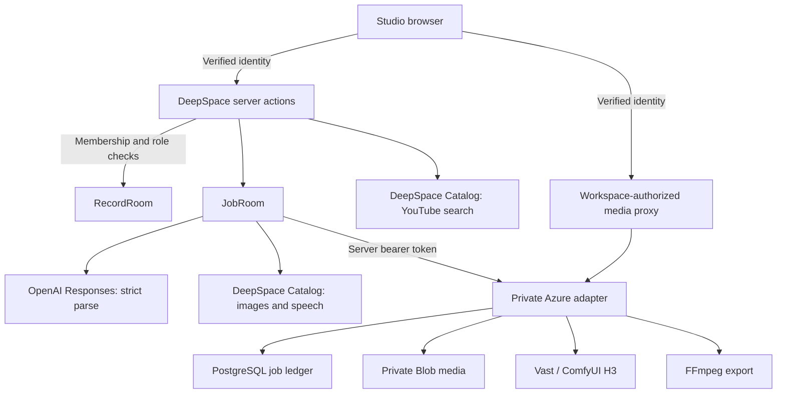

# Architecture

## Product boundary

Illustory is for a creative team working from one shared production plan.
The writer/editor shapes the story; the workspace owner authorizes generation;
a reviewer selects versions and requests delivery. This adaptation reuses the
original product's creative rules and private rendering service.

**Pilot assumption:** a small studio with a few projects and one active editor
per project. A 20–50-person team is a planning scenario, not a claim about a
customer deployment. Actual traffic, availability requirements and operating
costs have not been measured at that scale.

## Runtime

The media route proxies through the adapter; the browser receives no Blob
credential or private-service token. Product collections deny direct client
access. Server actions use platform record tools only after membership checks.
Generic browser Catalog and WebSocket routes are closed. Studio refreshes jobs
and assets every three seconds, rather than claiming collaborative text sync.

## Data model

| Record | Purpose |
|---|---|
| `workspaces`, `memberships` | Workspace identity and active user roles |
| `projects` | Script, editable storyboard, revision and selected asset IDs |
| `workflow-jobs` | Frozen inputs, requester, idempotency key, provider ID, status and result |
| `assets` | Version, originating job/revision, private storage key, MIME type, byte size and SHA-256 |

The [TypeScript domain](../src/illustory/types.ts), [persistent collections](../src/schemas/illustory-schemas.ts)
and [model output schema](../src/illustory/structured-output.ts) serve different
boundaries. `original-creative.ts` validates and maps model output into the editor
model. It preserves appearance, scene anchors, static first-frame action, local
environment, motion beats, emotions and dialogue.

## One generation request

1. An action verifies identity, spending approval, workspace role, target and
   required source assets. It checks the expected project revision.
2. It stores the frozen script/storyboard and selected asset metadata under a
   stable job ID, then enqueues the job in DeepSpace JobRoom.
3. Parsing makes two direct OpenAI Responses calls: Character Bible, then scenes
   and shots. Images/speech use Catalog. First frames, H3 and export go through
   the private API with a stable idempotency key.
4. The job runner checkpoints state and polls private work with `ctx.continue`.
   Catalog intent is recorded before calling the provider; an ambiguous result
   is not automatically billed again.
5. Before publishing, it checks the result, private file metadata, current project
   revision and cancellation state. It creates a version and selects the result
   only while the revision is current. See the concurrency limitation below.
6. The UI reads authorized status and media. Export email failure is recorded
   separately and does not invalidate the video.

[Server actions](../src/actions/index.ts) · [Job runner](../src/jobs.ts) · [Private client](../src/illustory/private-workflow.ts)

## Roles

| Action | Owner | Editor | Reviewer | Viewer |
|---|---|---|---|---|
| View workspace data | Yes | Yes | Yes | Yes |
| Create/edit project or storyboard | Yes | Yes | No | No |
| Generate, search references, load voices | Yes | No | No | No |
| Select asset version / export | Yes | No | Yes | No |
| Manage members, cancel jobs, enable export mail | Yes | No | No | No |

Sponsored actions also require app-owner spending approval. Becoming a workspace
owner does not grant credits. [Spending controls](SPENDING_ACCESS.md).

## Decisions

| Decision | Reason | Revisit when |
|---|---|---|
| Direct structured parsing | Preserve the original schema; the Catalog chat contract used here has no strict schema parameter | Catalog supports the required schema contract |
| Private GPU engine | Existing H3 workflow runs on a separately managed GPU | A deployment target supports that workload and access boundary |
| Private binary storage | Shared customer media needs workspace authorization | Platform storage fits the sharing model and measured file sizes |
| Authorized polling | Avoid broad room subscriptions exposing another workspace | Workspace-scoped subscriptions can enforce the same checks |
| No payment checkout | The current task is controlled evaluation access | Selling access becomes an actual requirement |

StoryNest and ThreadHunt were read for DeepSpace JobRoom/continuation patterns.
Illustory's storyboard schema, creative rules and filmmaking workflow came from
the existing product; it does not copy their product flows.

## Engineering gaps

| Gap and evidence | Category | Next action |
|---|---|---|
| Provider dollar caps are not active; approved accounts can repeat calls | Must Implement before sponsored reviewer testing | Apply the agreed project budgets and verify enforcement |
| Email returns sender-not-configured | Must Implement if email is presented as available | Configure sender and verify delivery |
| Project updates read a revision, then write separately | Must Implement before concurrent editing | Serialize project writes or use atomic compare-and-swap; test overlapping saves/publication |
| Private worker can be interrupted; ambiguous GPU work needs reconciliation | Must Understand for this pilot | Use durable execution or a budgeted persistent worker before unattended customer operation |
| Dependency audit has unresolved advisories | Must Implement before customer production | Review reachability and upgrade compatible affected dependencies |
| Studio keeps five stages, draft state and request handlers in one large component | Must Understand; refactor before expanding the editor | Extract stage views with explicit props in a separate behavior-tested change |
| Kubernetes, Kafka or a payment service | Do Not Build now | No measured workload or commercial requirement justifies them |

Current runtime evidence and unverified stages are maintained in
[VERIFICATION.md](VERIFICATION.md), rather than repeated here.
